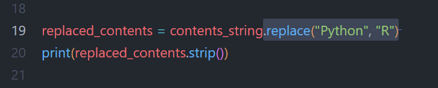

# WHAT I LEARNT

---

## Reading a Text file

Python has many functionalities, one of them is to **read a text file**. And by read I mean **go over each character and possibly do something** with them. 

So this is essentially what the **library pathlib** and its method `Path` enable. Now for the reading part, it is the job of the method `read_text()`. Very straightforward. 

We, Humans, appreciate structures and neatly put things. So lines are the basic unit for a **well structured text**. The method `splitlines()` helps getting the **text structured as lines**.  
And then we have `lstrip()` and `rstrip()` and also just `strip()` that will remove blank spaces depending on where they are as well as blank lines. A little bit like **special features of a text hoover**. 

---

## Replacing Text

And reading is just one aspect, there are more ways to work with files. One that I practiced here is the `replace()` method, that does just that: **replacing all instances of a word/character with another one**. 

--- 

## How Well Did I do?

No need to go over the solutions, the practice here is basic enough so that I don't need to check my work. 

---

#### Resources:
Python Crash Course 3rd Ed.: [Chapter 10](https://ehmatthes.github.io/pcc_3e/solutions/chapter_10/)
